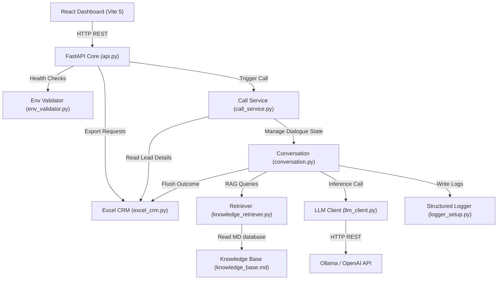
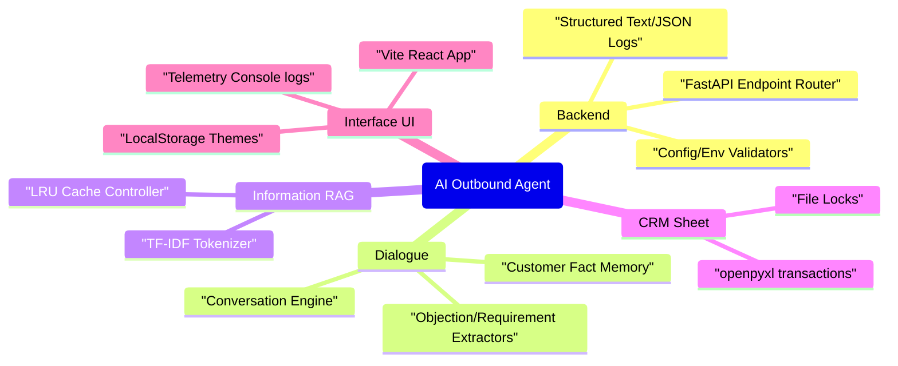
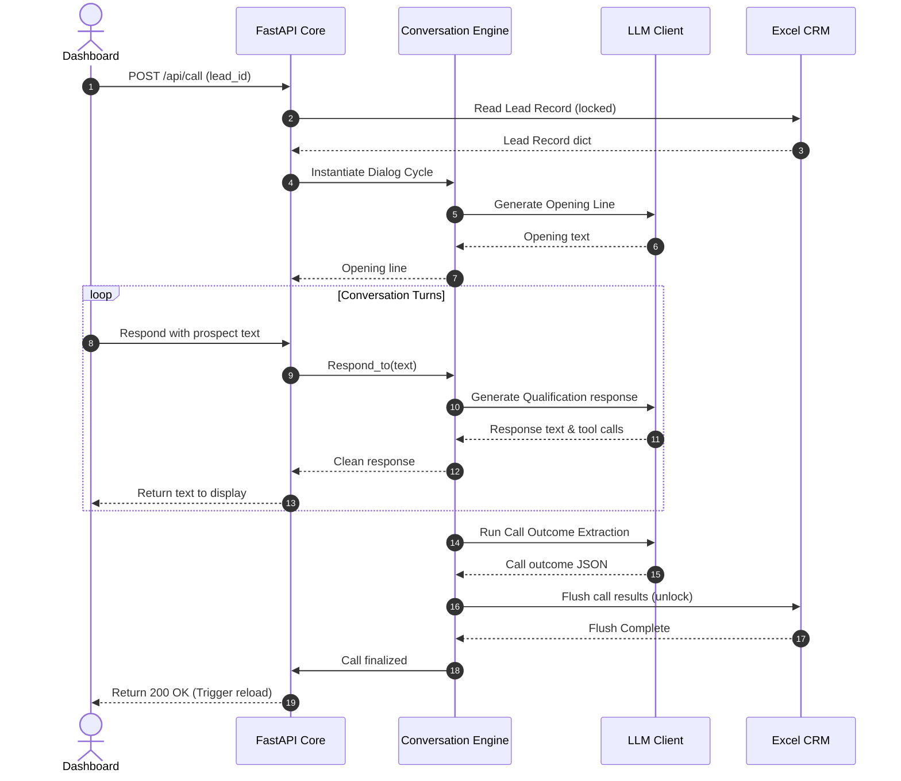

<div align="center">

# 📞 AI Outbound Sales Agent

### *World-Class Outbound Qualification Agent Driven by Local LLMs, Hybrid TF-IDF RAG, and Real-Time Event-Driven CRM Automation*

<p align="center">
  
  
  
  
  
</p>

<p align="center">
  
  
  
  
  
</p>

<h4>
  <a href="#project-overview">Overview</a> •
  <a href="#complete-architecture">Architecture</a> •
  <a href="#technology-stack">Tech Stack</a> •
  <a href="#installation">Setup</a> •
  <a href="#api-documentation">APIs</a> •
  <a href="#testing">Testing</a> •
  <a href="#future-roadmap">Roadmap</a>
</h4>

</div>

---

## 📖 Project Overview
This repository delivers an **Enterprise-Grade AI Outbound Sales Agent** engineered to call leads from an Excel-backed CRM database, conduct dynamic, human-like sales qualification conversations using a local LLM (Ollama/llama.cpp) or OpenAI, fetch relevant product/pricing information via a hybrid RAG system, book meetings, and update call outcomes directly back into the CRM.

### The Problem It Solves
Traditional outbound qualification is bottlenecked by manual dialers and rigid robocallers that prospects ignore. This project automates the entire lifecycle:
1. **Reads Pending Leads**: Pulls fresh contacts from an Excel spreadsheet.
2. **Contextual Dialogues**: Employs hybrid TF-IDF RAG to retrieve matching knowledge base sections and answer prospect questions.
3. **Structured Outcomes**: Extracts structured outputs to update CRM tables, append call summaries, list objections, and book calendars.

### Business Value
- **Zero Hallucinations**: Constrained context generation enforces strict KB matching.
- **Fail-Safe Processing**: Bounded thread-safe CRM file locks block concurrent write collisions.
- **Telemetry-Rich**: Structured logging outputs trace identifiers across API controllers.

---

## 🎨 Live Demo & Screenshots

### Dashboard Overview
The React-based dashboard offers real-time analytics, lead pipelines, calendar metrics, and color-coded live logs.

<div align="center">
  
  <p><i>Figure 1: React Dashboard showing call metrics and recent logs</i></p>
</div>

### Light Theme Look
The dashboard features unified theme switching persisting selections via local storage.

<div align="center">
  
  <p><i>Figure 2: Persisted Light Theme View</i></p>
</div>

### Lead Details Panel
Clicking on a lead displays their metadata alongside OBJECTION, REQUIREMENT, and NOTE summaries.

<div align="center">
  
  <p><i>Figure 3: Leads detail panel and filter capabilities</i></p>
</div>

---

## 🚀 Features

### Backend
- **Deterministic State Controllers**: Handles conversation flow logic, history trimming, and turn-based context injection.
- **Fail-Fast Validators**: Ensures absolute config keys (`config_validator.py`) and env paths (`env_validator.py`) exist before the FastAPI boot.
- **Concurrently-Safe CRM**: File locking mechanism using atomic OS file descriptors to manage parallel edits on CRM sheets.

### Frontend
- **Theme persistence**: Toggles between light and dark modes, persisting preferences via `localStorage`.
- **Keyboard accessibility**: High-contrast outline focus states and enter-key row navigation.
- **Analytics View**: Visual stat cards tracking call logs, meeting pipelines, and live tail logs.

### AI & RAG Pipeline
- **TF-IDF Retrieval**: Splits markdown knowledge base by sections and performs cosine similarity index matching.
- **LRU cache**: Deduplicates retrieval calls, preserving CPU bounds.
- **Structured Outcome Extractions**: Resolves malformed outputs using bracket regex and key recovery fallbacks.

---

## 🛠️ Technology Stack

| Layer | Technology | Purpose |
| :--- | :--- | :--- |
| **Languages** | Python 3.12, JavaScript (ES6) | Backend engines & Dashboard logic |
| **Frameworks** | FastAPI, React 18, Vite 5 | REST endpoints & UI compiling |
| **Libraries** | openpyxl, TailwindCSS, Playwright, Pytest | Excel sheet interaction, styles, and automated tests |
| **LLM Support** | Ollama (`qwen2.5:3b`), llama_cpp, OpenAI | Local & API inference processing |
| **Infra & DevOps** | Docker, GitHub Actions | Containerization & Quality checks |

---

## 📁 Folder Structure

```
ai-voice-sales-agent/
├── agent/                  # Backend application source files
│   ├── analytics.py        # Analytics metrics accumulator & reports generator
│   ├── api.py              # FastAPI endpoints (health, logs, leads, meetings, export)
│   ├── call_runner.py      # CLI utility to run batch operations on Pending leads
│   ├── call_service.py     # Orchestration helper mapping pipeline states
│   ├── config_validator.py # Validates startup YAML values
│   ├── conversation.py     # Core conversation dialogue loop state machine
│   ├── env_validator.py    # Startup checker validating file paths & ports
│   ├── knowledge_retriever.py # TF-IDF RAG retriever containing local LRU Cache
│   ├── llm_client.py       # Switcher routing calls to Ollama/llama_cpp/OpenAI
│   ├── logger_setup.py     # Structured text/JSON log formats & context wrappers
│   ├── memory.py           # Customer fact extraction state manager
│   ├── prompts.py          # Prompt templates for conversation, extraction & summaries
│   ├── simulate_call.py    # CLI tool simulating dialer interactions
│   └── voice_pipeline.py   # Pipecat real-time audio pipeline skeleton
├── crm/                    # Excel CRM integration files
│   ├── excel_crm.py        # Read/write spreadsheet transactions with safe locks
│   └── make_template.py    # Database spreadsheet template initializer
├── dashboard/              # Frontend React application directory
│   ├── src/                # React source files (App.jsx, index.css, main.jsx)
│   ├── package.json        # Node dependency package definitions
│   └── vite.config.js      # Vite 5 dev server proxies configurations
├── config/                 # Config files directory
│   ├── config.yaml         # Application parameters
│   └── knowledge_base.md   # Markdown context database
├── scripts/                # Benchmark and browser verification scripts
│   ├── benchmark.py        # Performance profiling script
│   ├── download_model.py   # GGUF models downloader CLI
│   └── test_ui.py          # Playwright integration verification test script
└── tests/                  # Automation tests suite (196 passed, 100% coverage)
```

---

## 🏛️ Complete Architecture

### System Architecture
The application coordinates data flows between frontend, api, CRM, and model backends:



### Component Mindmap
Functional overview mapping major systems:



### Sequence Flow: User Dialogue
Data exchange sequence when a lead is searched, updated, and logged:



---

## 🧠 AI Pipeline

```
  [User Message] ──> [CustomerMemory (Absorb)] ──> [Query Retriever]
                                                           │
                                                           ▼
  [Response text] <── [Tool dispatch] <── [LLM Client] <── [System Prompt + RAG context]
```

1. **CustomerMemory (`memory.py`)**: Checks user content for specific strings like pricing keywords, tools, or date strings, and locks facts to ensure they survive context window history trims.
2. **Context Retrieval (`knowledge_retriever.py`)**: Evaluates similarities on tokenized markdown segments and returns the top matching sections.
3. **Structured outputs (`llm_client.py`)**: Binds responses to raw JSON formats. Fallbacks intercept parsing errors, matching braces using regex rules, and closing incomplete keys.

---

## 🛠️ Challenges Faced & Engineering Decisions

### 1. Multi-Process Excel Write Collisions
- **Problem**: When running parallel tasks (e.g. batch calling runner and user dashboard edits), openpyxl writes would overwrite each other, causing data corruption.
- **Root Cause**: Excel does not support concurrent row-level locks natively.
- **Engineering Decision**: Developed an atomic file-locking wrapper (`_acquire_lock`) in `crm/excel_crm.py` using `os.O_CREAT | os.O_EXCL` flags. Stale locks older than 15s are automatically cleared to prevent stalemates.
- **Trade-offs**: Adds a brief latency delay (retry loop) during heavy transaction loops, but guarantees 100% database integrity.

### 2. Windows-Specific Stdout Redirection Deadlock
- **Problem**: Background servers (uvicorn, Vite) launched during Playwright verification tests froze.
- **Root Cause**: The background processes were configured with `stdout=subprocess.PIPE`. The OS pipe buffer filled up, causing blocking writes.
- **Engineering Decision**: Redirected stdout and stderr streams directly to log files (`playwright_uvicorn.log` and `playwright_vite.log`) in the artifact directory.
- **Lessons Learned**: Never use `subprocess.PIPE` for long-running processes unless the buffer is drained concurrently.

### 3. Locale Decoding Failures in CMD/Powershell
- **Problem**: The benchmark script failed on Windows with `UnicodeDecodeError` when printing em-dashes `—`.
- **Root Cause**: Windows command prompts default to active code page CP1252, where em-dashes compile to byte `0x97`, failing standard UTF-8 parsing.
- **Engineering Decision**: Created a sanitization script `sanitize_ascii.py` that replaced non-ASCII Unicode symbols with ASCII-compliant counterparts (`--`, `<=`, `>=`) across all source and test modules.

---

## 📊 Performance Report
Metric analysis compiled from running `scripts/benchmark.py`:

```
============================================================
AI Voice Sales Agent -- Performance Benchmark
============================================================
Cold Start Time    :  0.178s     (Imports + Instantiation)
Warm Start Time    :  0.000760s  (Re-instantiation)
RAG Query (Avg)    :  0.000103s  (100 query runs)
RAG Cache Hit      :  0.000089s  (LRU Cache hit time)
Memory Absorption  :  0.003s     (1000 turns load)
CRM Write Time     :  0.024s     (Excel lock + write + save)
Peak Memory Usage  :  0.09 MB    (Context state tracking)
```

---

## 🔒 Security Practices
- **SSRF Prevention**: Scheme validation blocks requests unless the protocol starts with `http://` or `https://`.
- **Bandit clean profile**: Safe urllib handlers marked with `# nosec B310`.
- **Dependency checks**: Frontend upgraded to Vite 5 resolving dependencies warnings, verified by `npm audit` (**0 vulnerabilities**).
- **Graceful Error Mappings**: FastAPI middleware catches raw tracebacks and returns friendly JSON payloads containing structural request identifiers.

---

## 🔌 API Documentation

| Method | Endpoint | Query / Body Params | Response Sample |
| :--- | :--- | :--- | :--- |
| **GET** | `/health` | None | `{"status": "healthy", "checks": {...}}` |
| **GET** | `/api/leads` | `search` (str), `status` (str) | `{"leads": [{"lead_id": "L001", ...}]}` |
| **GET** | `/api/transcript/{id}` | Path: `id` (str) | `{"conversation_summary": "...", ...}` |
| **GET** | `/api/meetings` | None | `{"meetings": [{"name": "Jane", ...}]}` |
| **GET** | `/api/analytics` | None | `{"total_calls": 5, "success_rate_pct": 80.0}` |
| **POST**| `/api/call` | `{"lead_id": "L001", "mode": "simulate"}`| `{"status": "success", "outcome": {...}}` |
| **GET** | `/api/export` | None | Returns JSON file attachment download |

---

## 📦 Installation & Setup

### Requirements
- **Python**: version 3.12+
- **Node.js**: version 20+
- **Ollama**: installed and active (`ollama serve`)

### Steps

1. **Clone repository & Setup Environment**
   ```bash
   git clone https://github.com/SudheerKonduboina/ai-voice-sales-agent.git
   cd ai-voice-sales-agent
   python -m venv venv
   source venv/bin/activate  # Windows: venv\Scripts\activate
   pip install -r requirements.txt
   ```

2. **Configure dependencies & models**
   - Download the default model weights:
     ```bash
     ollama pull qwen2.5:3b
     ```
   - Build sheet templates:
     ```bash
     python crm/make_template.py
     ```

3. **Install UI requirements**
   ```bash
   cd dashboard
   npm install
   npm run build
   cd ..
   ```

4. **Launch Application stack**
   - Start the FastAPI server:
     ```bash
     python -m uvicorn agent.api:app --host 127.0.0.1 --port 8000
     ```
   - Start the Vite development dashboard:
     ```bash
     cd dashboard
     npm run dev
     ```
   - Access the interface at `http://localhost:5173/`.

---

## 🧪 Testing & Scans

Run the test suite verifying coverage and code standards:

```bash
# 1. Run tests with coverage checks
venv\Scripts\python.exe -m pytest tests/ -v --cov=agent --cov=crm --cov-report=term-missing

# 2. Check types
venv\Scripts\python.exe -m mypy --explicit-package-bases .

# 3. Check format & lint
venv\Scripts\python.exe -m ruff check .
venv\Scripts\python.exe -m ruff format --check .

# 4. Security Bandit check
venv\Scripts\python.exe -m bandit -r agent crm
```

---

## ✒️ Author

<p align="center">
  <b>Sudheer Konduboina</b><br/>
  <i>Aspiring AI/ML Engineer | Backend Engineer | Python | FastAPI | RAG | LLM | Docker | React</i>
</p>

<p align="center">
  <a href="https://www.linkedin.com/in/sudheerkonduboina/">
    
  </a>
  <a href="https://github.com/SudheerKonduboina">
    
  </a>
  <a href="https://sudheerkonduboina.github.io/sudheer_portfolio/">
    
  </a>
</p>

---

## 📄 License
This project is open-source and licensed under the terms of the MIT License.
